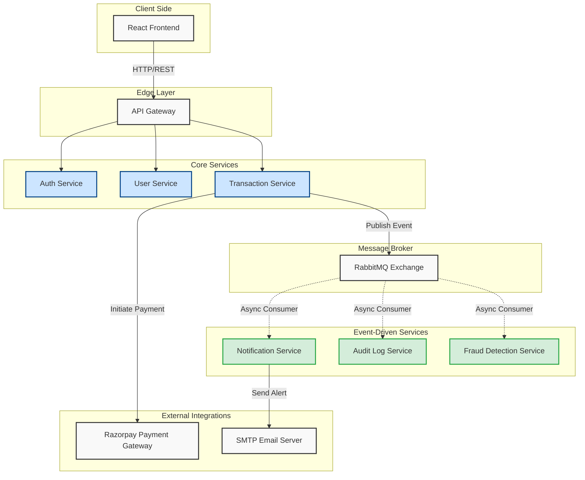

# 🏦 Global Bank - Distributed Microservices Ecosystem

[](https://opensource.org/licenses/MIT)
[](https://nodejs.org/)
[](https://reactjs.org/)
[](https://www.docker.com/)

A high-performance, enterprise-grade banking platform built with a **Microservices Architecture**. This system is engineered for eventual consistency, fault tolerance, and event-driven integrity using modern distributed system practices.

---

## 🏗️ System Architecture

Below is the high-level architectural design of the ecosystem. It leverages a centralized **API Gateway** for request routing and **RabbitMQ** for decoupled, asynchronous inter-service communication.



---

## ⚡ Key Features

- **Secure User Management**: JWT-based authentication with centralized `Auth Service`.
- **Real-Time Transactions**: Peer-to-peer money transfers and live balance updates.
- **Event-Driven Notifications**: Automated receipts and alerts dispatched via RabbitMQ broadcast.
- **Payment Gateway Integration**: Full integration with **Razorpay** for real-world fund loading and external UPI operations.
- **Fraud Detection System**: Asynchronous checking of transactional vectors to prevent malicious transfers.
- **Centralized Auditing**: Non-blocking recording of all core ledger operations for financial auditing.

## 🛠️ Technology Stack

### Backend & Infrastructure
- **Node.js & Express**: Core service frameworks.
- **RabbitMQ**: Message broker for highly-available distributed events.
- **MongoDB & Mongoose**: Persistent storage using document-based data models.
- **Docker & Docker Compose**: Full container orchestration for local and staging replication.
- **API Gateway**: Centralized routing and rate-limiting handler.

### Frontend
- **React.js**: Modern dynamic UI for the consumer experience.
- **TailwindCSS / Custom Styling**: Smooth, responsive modern banking interface.

---

## 🚦 Getting Started

### Prerequisites
- Docker Desktop
- Node.js (v18+)
- Git

### Installation

1. **Clone the repository**:
   ```bash
   git clone <YOUR_REPO_LINK_HERE>
   cd DIVYANSH-GLOBAL-BANK
   ```

2. **Configure Environment**:
   Each service contains a `.env.example`. Rename these to `.env` and populate them with your connection strings (MongoDB URI, RabbitMQ URI, Razorpay Keys).

3. **Run via Docker Compose**:
   Spin up the entire ecosystem (Gateway, 7 Services, and Database) with a single command:
   ```bash
   docker-compose up --build
   ```

---

## 🚀 Deployment

This system is optimized for rapid scaling and supports:
- **Containerized Deployment**: Using `render.yaml` or AWS ECS.
- **Health Orchestration**: Native cron-checks implemented to handle container warm-ups and cold-starts.

---
💡 *This project was engineered to solve the technical complexities of real-time distributed financial systems.*
